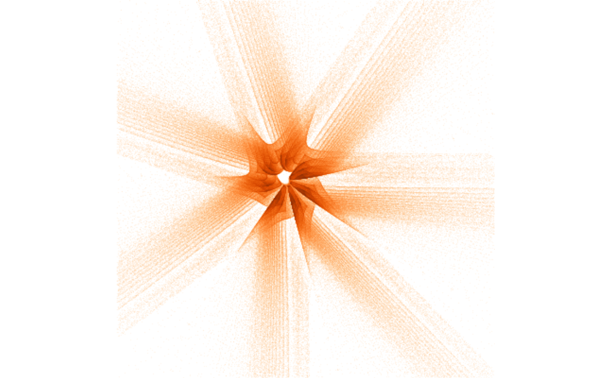

<!-- README.md is generated from README.Rmd. Please edit that file -->

# attractor

<!-- badges: start -->

<!-- badges: end -->

The goal of `attractor` is to generate and plot strange attractors.

Using this package is fast, because:

1.  The attractor algorithm uses `Rcpp` for speed.
2.  The resulting attractor is discretized (binned) into a much smaller
    matrix, making plotting very fast.

## Installation

You can install the development version from
[GitHub](https://github.com/) with:

``` r
# install.packages("devtools")
devtools::install_github("andrie/attractor")
```

## Example

Create a strange attractor with 10 million points, then discretize to a
matrix with dimensions `600 x 900`:

``` r
library(magrittr)
library(attractor)

dat <- 
  c(-0.8, 0.4, -1.1, 0.5, -0.6, -0.1, -0.5, 0.8, 1.0, -0.3, -0.6, -0.3, -1.2, -0.3) %>% 
  strange_attractor(1e6)
str(dat)
#>  num [1:600, 1:600] 0 0 0 0 0 0 1 2 1 1 ...
```

## Plotting a strange attractor

``` r
par(mar = rep(0, 4), mai = rep(0, 4))
dat %>% 
  log1p() %>%
  recolour() %>% 
  plot()
```

<!-- -->

## Recolour the plot

Use `recolour()` to change the colours. You can use any of the colours
defined by the `scales::col_numeric()` function. From the help of
`?scales::col_numeric()`:

The palette argument can be any of the following:

1.  A character vector of RGB or named colours. Examples: `palette()`,
    `c("#000000", "#0000FF", "#FFFFFF")`, `topo.colors(10)`

2.  The name of an `RColorBrewer` palette, e.g. `"BuPu"` or `"Greens"`.

3.  A function that receives a single value between 0 and 1 and returns
    a colour. Examples: `colorRamp(c("#000000", "#FFFFFF"),
    interpolate="spline")`.

Use the `Oranges` palette:

``` r
dat %>% 
  log1p() %>%
  recolour("Oranges") %>%
  plot()
```

<!-- -->

To change the background colour, specify a `zero_colour`:

``` r
dat %>% 
  log1p() %>%
  recolour("Oranges", zero_colour = "#FFFAF6") %>%
  plot()
```

<!-- -->

You can also invert the palette

``` r
dat %>% 
  log1p() %>%
  recolour("Oranges", zero_colour = "grey20", invert = TRUE) %>%
  plot()
```

<!-- -->

Try the `Spectral` palette:

``` r
dat %>% 
  log1p() %>%
  recolour("Spectral", zero_colour = "#F60006") %>%
  plot()
```

<!-- -->

With inversion:

``` r
dat %>% 
  log1p() %>%
  recolour("Spectral", invert = TRUE, zero_colour = "#6272A7") %>%
  plot()
```

<!-- -->
